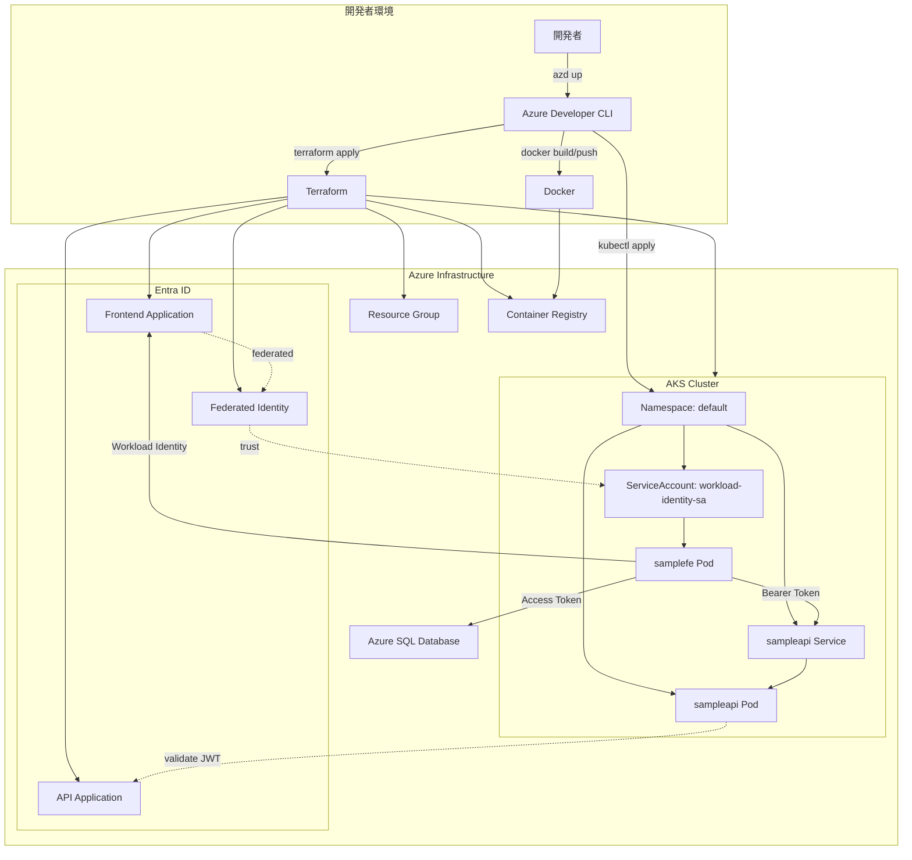
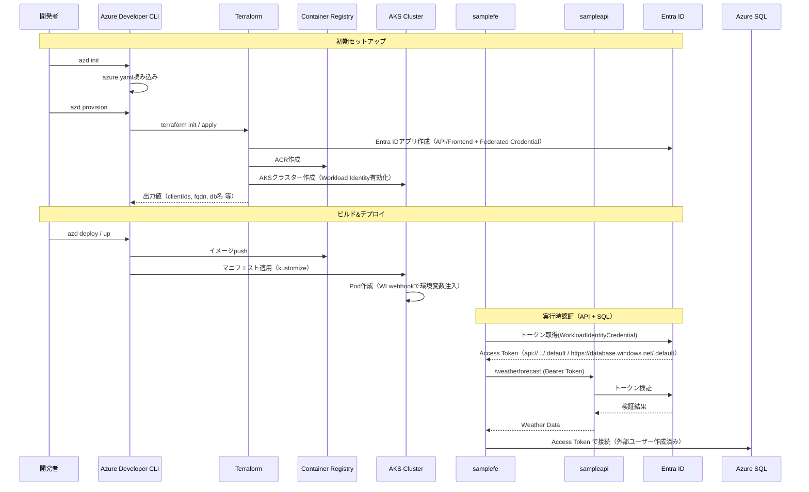

# Workload Identity Sample

Azure Kubernetes Service (AKS) 上で動作する Workload Identity を使用したアプリケーションとリソース設定のサンプル。アプリケーション間の認証、複数の接続先に対するIDの共用などはサンプルが少ないため作成した。

## 概要

このプロジェクトは、Azure Developer CLI (azd) を使用して、以下の2つの .NET アプリケーションを AKS にデプロイします：

- **samplefe**: Workload Identity を使用してトークンを取得し、sampleapi と Azure SQL Database を呼び出すクライアントアプリケーション
- **sampleapi**: JWT Bearer 認証を使用する Web API

## 前提条件

- [Azure Developer CLI (azd)](https://learn.microsoft.com/azure/developer/azure-developer-cli/install-azd)
- [Terraform](https://www.terraform.io/downloads) >= 1.12
- [Docker](https://docs.docker.com/get-docker/)
- [kubectl](https://kubernetes.io/docs/tasks/tools/)
- Azure サブスクリプション

> **注意**: このプロジェクトではazd のkustomize機能を使用するため、初期設定時に機能を有効化する必要があります。

### 必要なロール/権限

- Azure RBAC（サブスクリプション or 対象リソース グループ スコープ）
  - Owner（推奨）
    - もしくは Contributor + User Access Administrator（ACR へのロール割り当て作成が必要なため）
  - これらの権限で、RG/ACR/AKS/SQL などの作成と、`AcrPull` ロール割り当て（AKS→ACR）が可能になります。

- Entra ID（ディレクトリ ロール）
  - Application Administrator（推奨）または Cloud Application Administrator
    - アプリ登録/サービス プリンシパルの作成、アプリ ロール/ロール割り当て、フェデレーション資格情報（Workload Identity）の作成に必要
    - 組織設定で「ユーザーによるアプリ登録が許可」になっている場合でも、アプリ ロール割り当て等の操作に管理者ロールが必要です

- Azure SQL（Query editor 実行者）
  - プロビジョニング時に現在のユーザーが SQL Server の Entra ID 管理者に設定されます（Terraform）。
  - 生成された貼り付け用 SQL を実行する際は、その管理者ユーザーで Query editor (preview) にサインインしてください（MFA 必須の組織では MFA 通過が必要）。

## クイックスタート

1. リポジトリをクローン
```bash
git clone <repository-url>
cd wi-sample
```

2. Azure Developer CLI で環境を初期化
```bash
azd init

# Azure Developer CLI のkustomize機能を有効化（AKS環境で必要）
azd config set alpha.aks.kustomize on
```

3. tfvars テンプレートを配置（任意・推奨）
```bash
cp infra/main.tfvars.sample.json infra/main.tfvars.json
# 実行に必要な値は実行時に対話式で入力を要求されるが、事前に設定したい値があれば編集する
```

4. インフラストラクチャをプロビジョニング
```bash
azd provision
```

5. Azure SQL のユーザー作成（貼り付け実行）
- `azd provision` の後、貼り付け用 SQL が `tmp/sql/create-user-<DB名>.sql` に生成されます。
- Azure Portal > 対象 SQL Database > Query editor (preview) を開き、該当 SQL を貼り付け、Entra ID 管理者で実行してください。
  - なぜ貼り付け実行か: 多要素認証(MFA)や組織のセキュリティ ポリシーにより、CLI・非対話での DB ユーザー作成が失敗/複雑化するケースがあるためです。Query editor はブラウザで AAD 管理者として安全に実行でき、ローカルの IP 許可や追加ツール導入も不要なため、サンプルとしてシンプルかつ確実な手順にしています。

6. アプリケーションをデプロイ
```bash
azd deploy
```
 - デプロイ完了後、`kubectl logs -l app=samplefe -n default` でフロントエンドアプリのログを見てください。たとえば `SQL Database connected successfully.` が出ていればSQL Databaseに接続できています。

## プロジェクト構造

```
.
├── azure.yaml              # Azure Developer CLI 設定
├── infra/                  # Terraform によるインフラ定義
│   ├── main.tf
│   ├── providers.tf
│   ├── variables.tf
│   └── outputs.tf
├── src/
│   ├── sampleapi/         # Web API アプリケーション
│   │   ├── Dockerfile
│   │   └── k8s/           # Kubernetes マニフェスト
│   └── samplefe/          # フロントエンドアプリケーション
│       ├── Dockerfile
│       └── k8s/           # Kubernetes マニフェスト
└── docs/                  # ドキュメント
    ├── requirements.md    # 要件定義
    └── design.md         # 技術設計

```

## アーキテクチャ

### コンポーネント

- **Azure Kubernetes Service (AKS)**: コンテナオーケストレーション
- **Azure Container Registry (ACR)**: コンテナイメージの保存
- **Azure AD (Entra ID)**: 認証・認可
- **Workload Identity**: Pod レベルでの Azure リソースへのアクセス

### 認証フロー

1. samplefe が Workload Identity（Azure.Identity.WorkloadIdentityCredential）を使用してトークンを取得
2. 取得したトークンを使用して sampleapi を呼び出し（API スコープ: `api://.../.default`）
3. sampleapi がトークンを検証してレスポンスを返す
4. Azure SQL Database へは、samplefe が `https://database.windows.net/.default` のトークンで接続（接続先 DB に外部ユーザー（EXTERNAL PROVIDER）を作成済みであることが前提）

### 図（docs/design.md より転記）



### データフロー（docs/design.md より転記）



## 環境変数

### sampleapi
- `AzureAd__TenantId`: Azure AD テナント ID
- `AzureAd__ClientId`: API のクライアント ID
 - `AzureAd__Instance`: 認可エンドポイント（https://login.microsoftonline.com/）

### samplefe
- `AzureAd__TenantId`: Azure AD テナント ID
- `AzureAd__ClientId`: フロントエンドのクライアント ID（ServiceAccount 注釈へも連携）
- `AzureAd__Instance`: 認可エンドポイント（https://login.microsoftonline.com/）
- `Api__Scope`: API のスコープ（例: api://{API_APP_ID}/.default）
- `Api__Endpoint`: API エンドポイント（例: http://sampleapi/weatherforecast）
- `Sql__Server`: SQL サーバー FQDN（Terraform 出力で自動設定）
- `Sql__Database`: SQL データベース名（Terraform 出力で自動設定）
- `AZURE_AUTHORITY_HOST`（任意・SDK互換）: https://login.microsoftonline.com

## トラブルシューティング

### azd deploy でkustomize関連エラー

azd がkustomize機能を使用できない場合、以下のエラーが発生することがあります：
```
ERROR: kustomize not supported
```

対処法：
```bash
# kustomize機能が有効化されているか確認
azd config get alpha.aks.kustomize

# 有効化されていない場合は設定
azd config set alpha.aks.kustomize on
```

### ポッドが起動しない場合
```bash
kubectl get pods -n default
kubectl describe pod <pod-name> -n default
```

### Workload Identity の確認
```bash
kubectl get serviceaccount workload-identity-sa -n default -o yaml
```

## クリーンアップ

環境を削除する場合：
```bash
azd down
```

## ライセンス

[MIT License](LICENSE)
