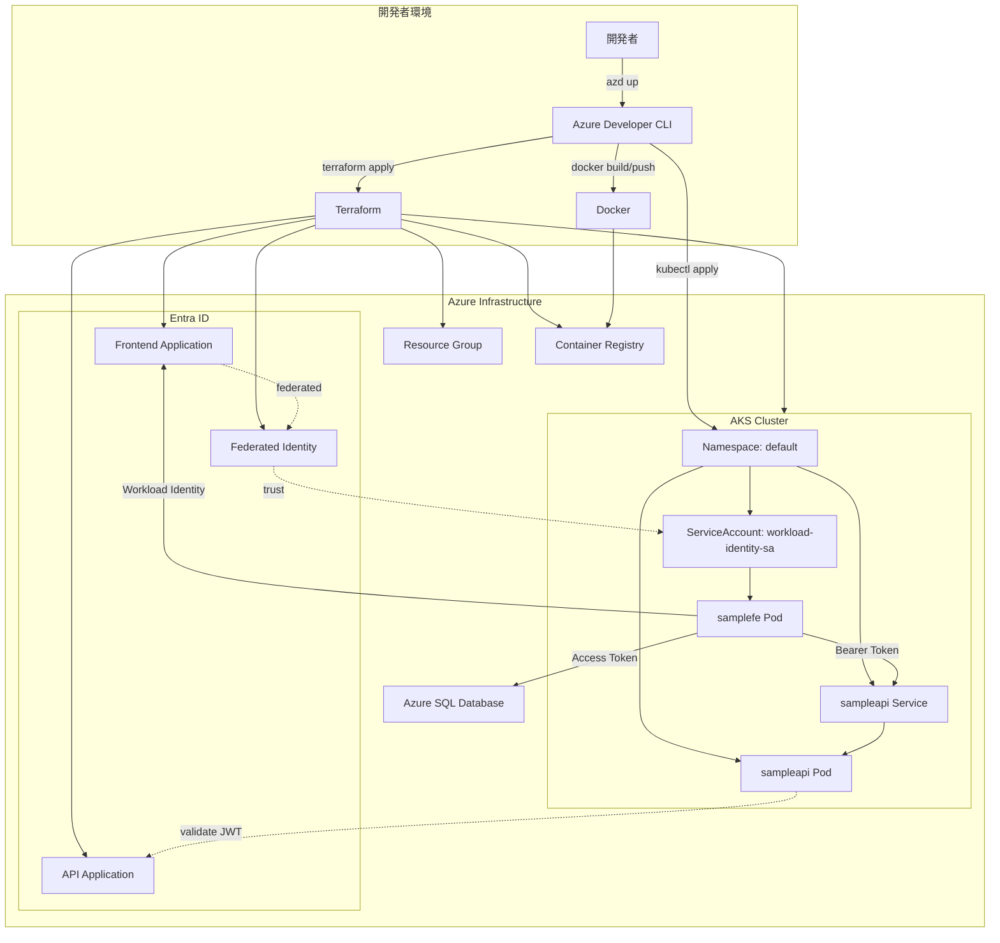
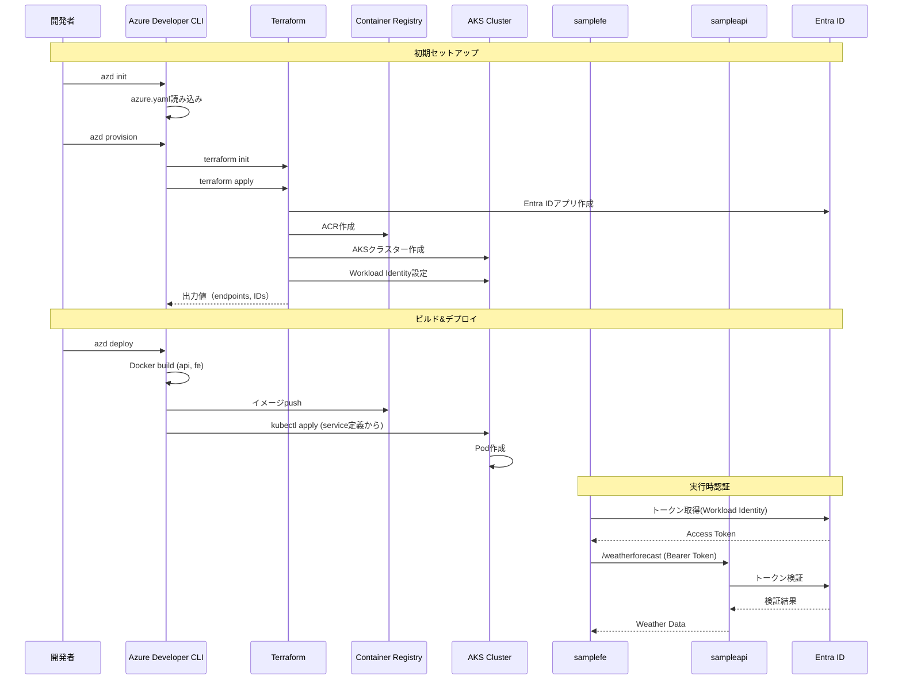
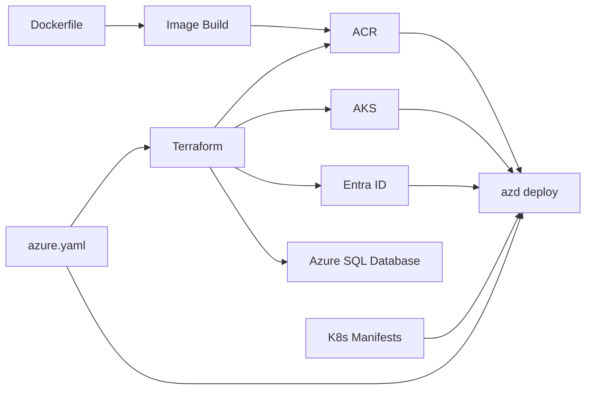

# 技術設計書

## アーキテクチャ概要



## コンポーネント

- **AKS**: アプリ実行基盤（`sampleapi`/`samplefe` Pod、ServiceAccount）
- **ACR**: コンテナイメージの保存
- **Entra ID**: アプリ登録（API/Frontend）、フェデレーション資格情報（Workload Identity）
- **Azure SQL Database**: `samplefe` からアクセストークンで接続（DB に EXTERNAL USER 作成前提）
- **azd + Terraform**: IaC/デプロイ管理（hooks で貼り付け用 SQL を生成）

## ディレクトリ構造

```
wi-sample/
├── .github/
│   ├── copilot-instructions.md
│   ├── instructions/
│   │   └── terraform.instructions.md
│   └── prompts/
│       └── spec-driven-workflow-v1.md
├── azure.yaml                    # Azure Developer CLI設定
├── infra/                        # Terraformインフラ定義
│   ├── main.tf                  # メインエントリポイント
│   ├── providers.tf             # プロバイダー設定
│   ├── variables.tf             # 変数定義
│   ├── outputs.tf               # 出力定義
│   ├── resource-group.tf        # リソースグループ
│   ├── container-registry.tf    # ACR設定
│   ├── kubernetes.tf            # AKSクラスター
│   ├── identity.tf              # Entra IDアプリケーション
│   └── workload-identity.tf     # Workload Identity設定
├── src/
│   ├── sampleapi/
│   │   ├── Api.csproj
│   │   ├── Program.cs
│   │   ├── appsettings.json
│   │   ├── Dockerfile           # 新規作成
│   │   ├── k8s/                 # Kubernetesマニフェスト
│   │   │   ├── deployment.yaml
│   │   │   └── service.yaml
│   │   └── README.md
│   └── samplefe/
│       ├── samplefe.csproj
│       ├── Program.cs
│       ├── Dockerfile
│       ├── k8s/                 # Kubernetesマニフェスト
│       │   ├── deployment.yaml
│       │   └── service-account.yaml
│       └── README.md
└── docs/
    ├── requirements.md
    ├── design.md               # 本ファイル
    ├── api.md
    └── deployment.md
```

## データフロー



## インターフェース定義

### 環境変数

#### Azure Developer CLI管理

```yaml
# .azure/<環境名>/.env
AZURE_SUBSCRIPTION_ID=<subscription-id>
AZURE_LOCATION=japaneast
AZURE_ENV_NAME=<環境名>
AZURE_CONTAINER_REGISTRY_NAME=<ACR名>
```

#### Terraform変数

```hcl
# infra/variables.tf
variable "environment_name" {
  description = "環境名"
  type        = string
}

variable "location" {
  description = "Azureリージョン"
  type        = string
  default     = "Japan East"
}

variable "api_app_name" {
  description = "API用Entra IDアプリケーション名"
  type        = string
}

variable "frontend_app_name" {
  description = "フロントエンド用Entra IDアプリケーション名"
  type        = string
}
```

#### Kubernetesマニフェスト

```yaml
# ConfigMapまたはSecretで管理
apiVersion: v1
kind: ConfigMap
metadata:
  name: api-config
data:
  AzureAd__TenantId: "${AZURE_TENANT_ID}"
  AzureAd__ClientId: "${API_CLIENT_ID}"
  AzureAd__Instance: "https://login.microsoftonline.com/"
```

### Azure Developer CLI Service定義（実体に合わせて簡易）

```yaml
# azure.yaml
name: wi-sample
services:
  sampleapi:
    project: ./src/sampleapi
    host: aks
    language: dotnet
    docker:
      path: Dockerfile
      context: .
    k8s:
      namespace: default
      kustomize:
        dir: ./k8s
  
  samplefe:
    project: ./src/samplefe
    host: aks
    language: dotnet
    docker:
      path: Dockerfile
      context: .
    k8s:
      namespace: default
      kustomize:
        dir: ./k8s
```

### API定義

#### sampleapi

| エンドポイント | メソッド | 認証 | レスポンス |
|------------|--------|-----|-----------|
| /weatherforecast | GET | Bearer Token (Forecast.Read role) | WeatherForecast[] |

#### 認証フロー

1. **samplefe**: Workload Identity（Azure.Identity.WorkloadIdentityCredential）でトークン取得
2. **sampleapi**: JWT Bearer token検証
3. **ロール確認**: Forecast.Readロールの検証

## データモデル

### WeatherForecast

```csharp
record WeatherForecast(
    DateTime Date,
    int TemperatureC,
    string? Summary
)
{
    public int TemperatureF => 32 + (int)(TemperatureC / 0.5556);
}
```

## エラー処理

### エラーマトリックス

| エラータイプ | 原因 | 対処 | HTTPステータス |
|------------|-----|-----|--------------|
| 認証失敗 | トークンなし/無効 | 401 Unauthorized返却 | 401 |
| 認可失敗 | Forecast.Readロールなし | 403 Forbidden返却 | 403 |
| API接続失敗 | ネットワーク/DNS | リトライ（最大3回） | - |
| Pod起動失敗 | イメージpull失敗 | ACR認証確認 | - |
| Workload Identity失敗 | フェデレーション設定ミス | ServiceAccount確認 | - |

## 単体テスト戦略

### テスト対象

1. **インフラストラクチャ**
   - Terraform validation (`terraform validate`)
   - Terraform plan検証
   - tfsec/checkovによるセキュリティスキャン

2. **アプリケーション**
   - sampleapi: JWT検証ロジック
   - samplefe: トークン取得とリトライロジック

3. **統合テスト**
   - End-to-endの認証フロー
   - Kubernetesデプロイメント検証

## 実装計画

### タスクリスト

1. **Azure Developer CLI設定** (30分)
   - azure.yaml作成（service定義含む）
   - 環境変数設定

2. **Terraformインフラ定義** (2時間)
   - プロバイダー設定
   - リソースグループ作成
   - ACR設定
   - AKSクラスター定義
   - Entra IDアプリケーション（手動作成の指示）
   - Workload Identity設定

3. **Dockerfile作成** (30分)
   - sampleapi用Dockerfile作成
   - マルチステージビルド設定

4. **Kubernetesマニフェスト** (1時間)
   - ServiceAccount（Workload Identity用）
   - Deployment（api, fe）
   - Service（api用）
   - 環境変数のテンプレート化
   - 各サービスのk8sディレクトリに配置

5. **環境変数管理** (30分)
   - ConfigMap/Secret定義
   - 環境別設定
   - azd環境変数との統合

### 依存関係



## セキュリティ考慮事項

注: 本セクションは「検討事項」の提示であり、本サンプルの既定実装には含まれていません。必要に応じて導入してください。

1. **Terraformステート管理**
   - Terraformステートファイルはローカル管理（本番環境ではAzure Storageなどチームで管理できるリモートを推奨）

2. **ネットワークセキュリティ**
   - AKSのプライベートクラスター化
   - Network Policyによるトラフィック制御

3. **コンテナセキュリティ**
   - 非rootユーザー実行（USER 65532:65532）
   - 最小権限の原則
   - イメージスキャン

## パフォーマンス考慮事項

注: 本セクションは「検討事項」の提示であり、本サンプルの既定実装には含まれていません。必要に応じて導入してください。

1. **ビルド最適化**
   - マルチステージビルドによるイメージサイズ削減
   - レイヤーキャッシュの活用

2. **デプロイ最適化**
   - ローリングアップデート戦略
   - リソースリミット設定

3. **スケーリング**
   - HPA（Horizontal Pod Autoscaler）設定
   - クラスターオートスケーラー

## 設定・ログ・ヘルスの統一

### 設定（階層キー）

- 方針: `appsettings.json` + 環境変数（`__` 区切り）で上書き。
- `sampleapi`
  - `AzureAd:Instance` / `AzureAd:TenantId` / `AzureAd:ClientId` / `AzureAd:Roles:0..`
- `samplefe`
  - `Api:Endpoint`（env: `Api__Endpoint`）
  - `Api:Scope`（env: `Api__Scope`）
  - `Sql:Server`（env: `Sql__Server`）
  - `Sql:Database`（env: `Sql__Database`）

### ログ（共通設定）

- Console: `SimpleConsole`、`SingleLine=true`、`TimestampFormat="yyyy-MM-ddTHH:mm:ss.fffZ "`、最小レベル `Information`。

### ヘルスチェック

- 共通で HTTP `/healthz` を提供。
  - `sampleapi`: ASP.NET Core HealthChecks を有効化（`MapHealthChecks("/healthz")`）。
  - `samplefe`: Kestrel を起動し `/healthz` を公開（ポート `8080`）。
