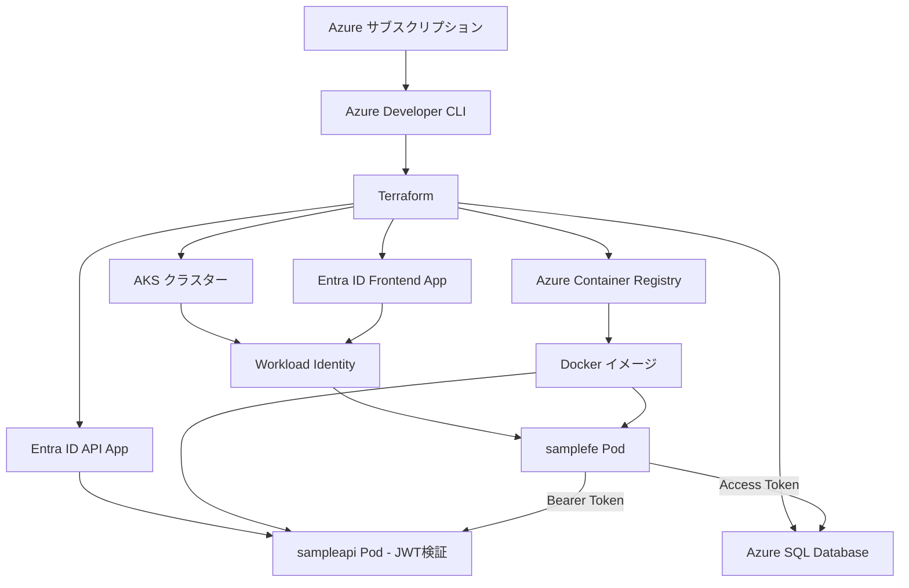
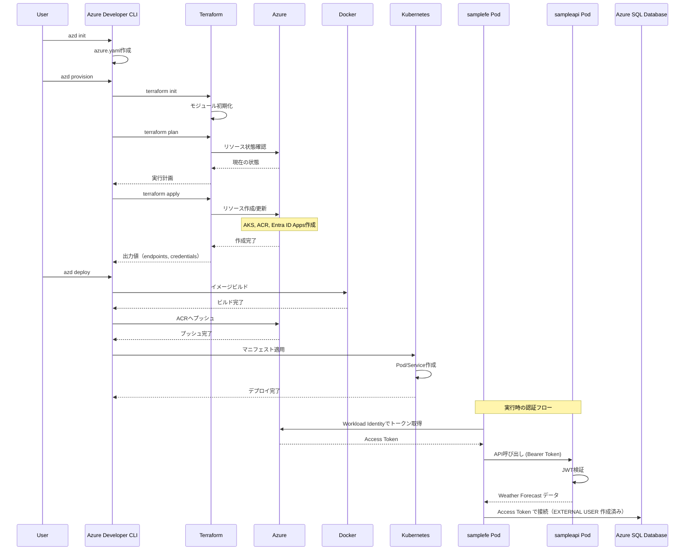

# 要件定義書

## プロジェクト概要
Azure Developer CLI (azd) を使用して、Azure Kubernetes Service (AKS) 環境の構築と.NETアプリケーションのデプロイを自動化する。インフラストラクチャの定義にはTerraformを使用する。

## EARS記法による要件定義

### 機能要件

#### FR-001: Azure Developer CLI初期化
- **普遍的**: システムは常に `azd init` コマンドで新規プロジェクトを初期化できるものとする
- **状態駆動**: プロジェクトが未初期化の状態の間、システムは azure.yaml ファイルの生成を求めるものとする

#### FR-002: インフラストラクチャプロビジョニング
- **イベント駆動**: `azd provision` コマンドが実行されたとき、システムはTerraformを使用して以下のAzureリソースをプロビジョニングするものとする
  - Azure Kubernetes Service (AKS) クラスター
  - Azure Container Registry (ACR)
  - Azure Entra ID アプリケーション登録（API用）
  - ユーザー割り当てマネージドID（フロントエンド用）
  - Workload Identity フェデレーション設定（フロントエンドUAMIに付与）
  - リソースグループ
  - 仮想ネットワーク（必要に応じて）
  - Azure SQL Database（SQL Server + Database、Entra ID 管理者設定、Azure サービス許可ルール 0.0.0.0）

#### FR-003: Terraform統合
- **普遍的**: システムは常にTerraformファイル（.tf）を使用してインフラストラクチャを定義するものとする
- **イベント駆動**: `azd provision` が実行されたとき、システムは自動的に `terraform init`, `terraform plan`, `terraform apply` を実行するものとする
- **状態駆動**: Terraformステートファイルが存在する間、システムは既存リソースの状態を管理し、差分のみを適用するものとする

#### FR-004: アプリケーションビルド
- **イベント駆動**: `azd build` コマンドが実行されたとき、システムは以下を実行するものとする
  - sampleapi用Dockerイメージのビルド
  - samplefe用Dockerイメージのビルド
  - ビルドされたイメージのACRへのプッシュ

#### FR-005: アプリケーションデプロイ
- **イベント駆動**: `azd deploy` コマンドが実行されたとき、システムは以下を実行するものとする
  - Kubernetesマニフェストの適用
  - ServiceAccountの作成（samplefe用、Workload Identity設定付き）
  - Deployment/Podのデプロイ（最新のコンテナイメージを使用）
  - sampleapi用のServiceリソース作成（クラスター内通信用）

#### FR-006: 環境変数管理
- **普遍的**: システムは常に以下の環境変数を管理し、適切にアプリケーションに渡すものとする
  
  **sampleapi用:**
  - AzureAd__TenantId（appsettings.jsonまたは環境変数）
  - AzureAd__ClientId（API用アプリケーションID）
  - AzureAd__Instance（https://login.microsoftonline.com/）
  
  **samplefe用:**
  - AzureAd__TenantId（Workload Identity・設定の統一）
  - AzureAd__ClientId（フロントエンド用UAMIのClient ID）
  - AzureAd__Instance（https://login.microsoftonline.com/、任意）
  - Api__Endpoint（sampleapi ServiceのURL）
  - Api__Scope（api://{API_APP_ID}/.default）
  - Sql__Server（例: sql-wi-sample-<env>.database.windows.net）
  - Sql__Database（例: sqldb-wi-sample-<env>）
  - AZURE_AUTHORITY_HOST（https://login.microsoftonline.com、SDK互換のため任意）

- **イベント駆動**: Terraformの出力値が生成されたとき、システムは自動的に環境変数として設定するものとする

#### FR-007: セキュリティ設定
- **普遍的**: システムは常に以下のセキュリティ設定を適用するものとする
  - コンテナは非rootユーザーで実行（USER 65532:65532）
  - samplefeはAzure.IdentityのWorkloadIdentityCredentialで認証（シークレット不要）
  - sampleapiはJWT Bearer token検証による認証
  - ロールベースアクセス制御（RBAC）- Forecast.Readロール
  - Azure SQL: 対象DBにサービス プリンシパルの外部ユーザー（EXTERNAL PROVIDER）を作成し、最小権限（db_datareader 等）を付与
  - Terraformステートファイルの安全な管理

### 非機能要件

#### NFR-001: 簡易性
- **普遍的**: システムは常に3つ以下のコマンド（init, provision, deploy）で環境構築からデプロイまでを完了できるものとする

#### NFR-002: 再現性
- **普遍的**: システムは常に同じTerraformファイルから同一の環境を構築できるものとする
- **普遍的**: システムは常にTerraformステートファイルを使用してインフラストラクチャの状態を追跡するものとする

#### NFR-003: 保守性
- **普遍的**: システムは常に環境固有の設定を環境変数として外部化し、コードから分離するものとする
- **普遍的**: システムは常にTerraformの変数ファイル（.tfvars）を使用して環境別の設定を管理するものとする

#### NFR-004: 冪等性
- **普遍的**: システムは常に同じコマンドを複数回実行しても同じ結果を保証するものとする

### 制約事項

#### C-001: 技術スタック
- **普遍的**: システムは常に以下の技術スタックを使用するものとする
  - .NET 9.0
  - Azure Kubernetes Service
  - Azure Container Registry
  - Azure Entra ID
  - Azure SQL Database
  - Azure Developer CLI
  - Terraform (IaC)

#### C-002: 認証方式
- **普遍的**: samplefeは常にAzure Workload Identityを使用してトークンを取得するものとする
- **普遍的**: sampleapiは常にJWT Bearer token検証を使用して認証を行うものとする

#### C-003: Infrastructure as Code
- **普遍的**: システムは常にTerraformを使用してインフラストラクチャを定義・管理するものとする
- **望ましくない動作**: Azureポータルでの手動変更が行われた場合、システムは次回のprovision時に定義された状態に戻すものとする

## 依存関係

### 必須ツール
- Azure サブスクリプション
- Azure Developer CLI インストール済み
- Terraform インストール済み
- Docker インストール済み
- kubectl インストール済み

## 成功基準

1. `azd up` コマンド一つで全環境構築とデプロイが完了する
2. Terraformが正常に実行され、すべてのリソースが作成される
3. デプロイ後、samplefeがWorkload Identityでトークンを取得できる
4. samplefeが取得したトークンでsampleapiを正常に呼び出せる
5. sampleapiがトークンを正しく検証し、Forecast.Readロールを確認する
6. samplefeが `https://database.windows.net/.default` のトークンで Azure SQL Database に接続できる（DB に外部ユーザーが作成済み）
7. 環境変数の変更のみで異なる環境にデプロイできる
8. `terraform plan` で差分が正しく検出される

## UAMIの前提条件と制約

以下の条件をすべて満たす場合に限り、フロントエンド（`samplefe`）はユーザー割り当てマネージドID（UAMI）で動作します。

- 同一テナント: UAMIとアクセス先（APIのアプリ登録、Azure SQL）は同一のEntra IDテナント内に存在すること（クロステナントは不可）。
- AKS設定: AKSで`oidc_issuer_enabled=true`かつ`workload_identity_enabled=true`であること。ServiceAccountの`subject`がフェデレーション資格情報（FIC）の`subject`と一致していること。
- Pod注入: 対象Podに`azure.workload.identity/use: "true"`が付与され、`azure.workload.identity/client-id`にUAMIの`clientId`が設定されること（本プロジェクトはkustomizeで注入）。
- 権限付与: UAMIのサービスプリンシパルにAPIアプリのロール（`Forecast.Read`）が割り当てられていること。Azure SQL側でUAMIの外部ユーザーが作成され、最小権限が付与されていること。
- トークン種別: 要求されるトークンがアプリケーション権限（`roles`クレーム）で事足りること（ユーザー委任`scp`は付与されない）。
- SDK対応: `Azure.Identity` 1.11以上で`WorkloadIdentityCredential`を使用できること（本リポは1.12.0）。

次のいずれかに該当する場合、UAMIではなくフロントエンド側の「アプリケーション登録（アプリ/SP）」が必要です。

- クロステナント: アクセス先が別テナントに存在する（UAMIは基本的にクロステナント非対応）。
- エンドユーザー認証が必要: ブラウザSPAやユーザーサインイン/同意（PKCE等）が必要なシナリオ。
- 委任許可が必須: API側がユーザーコンテキスト（`scp`）必須の設計になっている。
- UAMI非対応サービス: 対象サービス/サードパーティAPIがUAMI（Managed Identity）を受け付けない。

上記に該当する場合は、フロントエンド用のアプリ登録＋フェデレーション（Workload Identity）構成に切り替えてください。

## エッジケース

1. **既存リソースの存在**: 同名のリソースが既に存在する場合、Terraformのインポート機能を使用するか、エラーメッセージを表示する
2. **Terraformステートの不整合**: ステートファイルが破損した場合、リカバリ手順を提供する
3. **権限不足**: Azure権限が不足している場合、必要な権限を明示的に表示する
4. **ネットワーク障害**: ACRへのプッシュ失敗時は3回までリトライする
5. **イメージビルド失敗**: Dockerfileのエラーは詳細なログとともに表示する
6. **Terraform実行失敗**: plan/apply失敗時は、エラーの詳細と修正方法を提示する
7. **トークン検証失敗**: JWT検証エラー時は、設定の不一致を確認するガイドを提供する

## データフローと相互作用

## 信頼度評価

**信頼度スコア: 92%**

**根拠**:
- 要件が明確で具体的（+30%）
- 使用技術が成熟しており実績がある（+25%）
- Azure Developer CLIとTerraformの組み合わせは標準パターン（+25%）
- 既存コードベースが存在し分析済み（+10%）
- 認証フローが明確に定義されている（+2%）

**リスク要因**:
- Entra IDアプリケーション登録のTerraform自動化に一部制限がある可能性（-5%）
- Workload Identity設定の複雑性（-3%）
